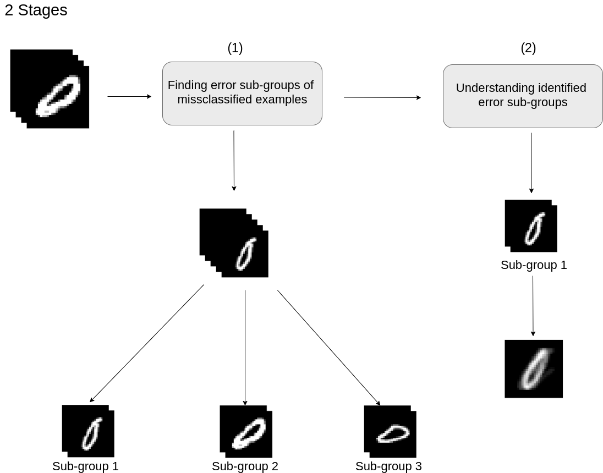

# Categorizing classification errors

Categorizing classification errors is a research project that aims to better understand why images trained using an artifial neural network classifier are missclassified. This problem is approached by categorizing the missclassified images into sub-groups depending on their error types.

    

## Team members
- Mohamed Khalifa 
- <a href="https://www.linkedin.com/in/hatim-elagib-93359a1a5/"> Hatim Elagib</a>
- <a href="https://www.linkedin.com/in/mohamed-abdelrazek-bb211a199/">Mohamed Abdelrazek</a>

## Supervisors
<a href="https://ai.ovgu.de/">AI Lab, Otto von Guericke University Magdeburg</a>
- <a href="https://ai.ovgu.de/Staff/Stober.html">Prof. Dr-Ing. Sebastian Stober</a>
- <a href="https://ai.ovgu.de/Staff/Krug.html">M.Sc. Andreas Krug</a>

## Source code 
Click [here](./code) to view our code.

## Blog post
Click [here](./blog/Blog.md) to read our blog post.

## Presentation
Click [here](./presentations) to view our presentations we did until now for this research project.

