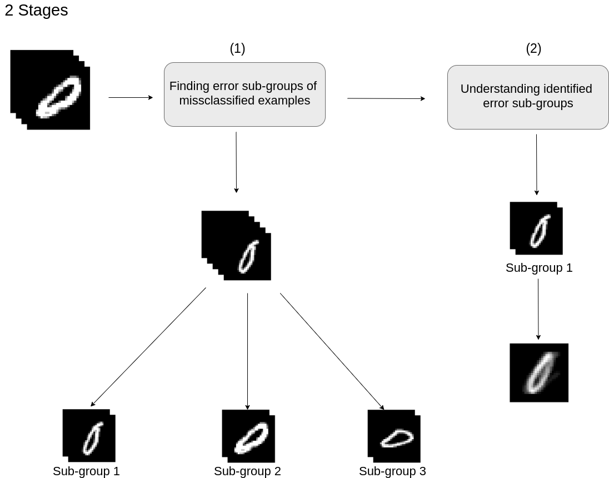

# Categorizing classification errors

## Table of contents

[[_TOC_]]

Image classification has been a widely used approach in the last years especially with the introduction of artificial neural networks and deep learning.
Image classification is an approach of assigning images to a certain class or label group. 
Upon testing the image classifier on new images, image misclassification can happen.
In general when we see a model with some percentage of misclassification, we are always eager to ask ourselves why this happens or in concrete words: Why (or what is the reason) did the classifier misclassify these images.
In this blog post, we aim to explain the reason for the misclassification of artificial neural networks by categorizing the images into several sub-groups. With each sub-group corresponding to a different error category. Needless to say, there are several different approaches that try to tackle this problem. Nevertheless, we aim with this novel approach to have an automatic approach that can easily let the user understand why the misclassification happened. Additionally to inform the user which type of errors are responsible for the misclassification with the help of categorization.

    
     
     
    
Figure 1: A general overview of the proposed approach for categorizing classification errors.

## Introduction

Although deep neural networks have shown remarkable results with image classification, they have been always depicted as a black box in the last years. This is why an important research field like explainable AI (XAI) has emerged in the last few years. The goal of XAI is to try to let users understand why a specific machine learning model did choose a specific decision over another. For example in image classification, the goal is to understand why the model correctly/incorrectly classified a specific image. Another question would be how did the model classify this image or what made the model sure that a specific image is what it should be.
Through the years many approaches came out that try to let us understand these specific model decisions a little better. A simple example would be visualizing learned feature maps of the model after the training phase [1]. Another approach is saliency maps. There are several types of saliency map approaches, for example, there is the vanilla gradient [11] saliency and layer-wise relevance propagation [2]. Such approaches try to give us a better understanding of why a specific input (e.g. image data) has been correctly classified or misclassified.

In this article we try a novel and a different approach in order to understand this “why” question. The question of “why the model is misclassifying a specific input image”. We do this in which we try to categorize the misclassified image into groups of images that are similar to each other. After that we try to find a way of visualizing the misclassification error subtype in each category of images. We aim with this novel approach/experiment to let the users better understand why a model chooses a specific decision over another when it comes to image classification.

### Experiment setup and stages

In order to implement this whole approach in general, we divide our categorizing of classification errors approach into two stages. In stage 1 our goal is to try to create/find the error sub-groups of the misclassified examples in the most suitable way possible so that it can help us in stage 2. Speaking about stage 2, this stage is mainly concerned about the understanding of the identified error sub-groups, or in other words, why is a specific group misclassified.

    
     
     
    
Figure 2: Overview of the proposed stages for categorizing of misclassified images. 

Both of these stages hopefully can systematically help us in a way or another to understand why those images are being misclassified. In the next sections of this blog, we dive deep into each stage and talk about what approaches we have done in order to achieve our experiment goals. Additionally we discuss what type of difficulties that we have faced. For this experiment we will be experimenting with both the MNIST [3] and CIFAR10 [4] dataset.

## Stage 1: Identifying error sub-groups of misclassified images

Our main goal in this stage as we discussed in the previous section is to find a way to categorize the misclassified images into sub-groups. Our baseline approach for this stage is to sub-divide the images into groups according to their image similarities. By doing so we obtain all images that are similar to each other in one group. For example, using the MNIST dataset we get a sub-group/category of images of a 0 that is tilted a little to the right. Another sub-group/category can contain for example all images of 0 that do not have a fully closed circle. The figure below shows visual examples of some sub-groups.

In order to achieve such sub-groups of images, we implement a baseline approach. 
This approach consists of using the feature vectors of the misclassified images of the last convolutional layer in our classifier. We then flatten these feature vectors and use them as an input to a simple clustering approach like K-means [5]. Using K-means we can hopefully separate several images into clusters (or sub-groups) according to their obtained feature vectors. But still, there is an important question to be answered and that is: “how many clusters do we define?”. Of course, one can try out different numbers of clusters and observe the result, but this will not always work, especially with large and complex datasets. That is why we need to depend on a systematic method that can help us in determining the number of clusters. To solve this problem we use the average silhouette method. The average silhouette method determines how well each point instance lies within its cluster. Having a high average silhouette score indicates a good clustering. We then calculate the average silhouette scores for a specific range of clusters (e.g. from 2 to 9) and observe which cluster has a high average silhouette score.

The following figures (Figure 3 and 4) show some examples of the MNIST dataset images (0 and 1) categorized into sub-groups after applying the K-means approach. As we can see our baseline approach manges to cluster the misclassified images into several sub-groups depending on their feature vectors for the MNIST dataset.

    
     
     
    
Figure 3: Sub-groups of the digit 0 after applying the grouping baseline approach using k-means. (Number of shown clusters 5 out of 5).

 

    
     
     
    
Figure 4: Sub-groups of the digit 1 after applying the grouping baseline approach using k-means. (Number of shown clusters 5 out of 8).

 
Unfortunately this baseline approach for this stage does not scale for complex datasets (e.g. CIFAR10). This is because images in such datasets are very different from each other and can contain different scenes or poses. Other than that, the type of the images (e.g. grayscale) in the dataset also plays an important role in the scalability of this approach.
Figure 5 below shows the result of applying the baseline approach on the CIFAR10 dataset.
 
 

    
     
     
    
Figure 5: Overview of the divided sub-groups after applying the grouping baseline approach using k-means for the misclassified image examples in the CIFAR10 dataset.

 
As we can see from the figure the dataset is much more complex than before and therefore the sub-groups are not perfectly divided compared to the MNIST dataset. This is why we need to find another method for dividing the images into sub-groups so that we can better scale the baseline approach for complex datasets.

### Method: Embeddings

In order to get a better distribution of similar images in our sub-groups we use embeddings [5]. Embeddings are a low-dimensional space in which we can translate high-dimensional data to be represented as a low-dimensional vector. Embeddings are mostly used in Natural language processing (NLP) [6], but in the last few years, such an approach has been also used for images as well.
The main advantage of using embeddings is that it captures the semantic of the input data. This allows for example similar images to be placed near each other in the embedding space, making it easier to find similar images by computing the distance between the images.
This in the end will improve our baseline approach, by using the low-dimensional embedding vectors for the clustering step instead of the normal feature vectors we hope to obtain a better distribution of similar images in the sub-groups.
There are several pre-trained models that can be used to obtain embedding vectors, for our case we used a VGG16 [7] as it was clearly experimented in [8]. Figure 6 below shows an example of one sub-group that we have obtained using this approach.
 
 

    
     
     
    
Figure 6: Result of a specific sub-group images after applying the embeddings approach for categorizing the images. We can observe in the figure how the embedding approach helps in grouping similar images together.

 

### Method: Autoencoders

To try to enhance the baseline method, we try another approach using autoencoders [9]. In general, autoencoders consist of an encoder and a decoder, and the main goal for vanilla autoencoders is to reconstruct the low-level learned representation. Autoencoders and embeddings(e.g. VGG16) have the same goal of capturing the semantic of the input data. What is different with autoencoders is that it uses an unsupervised approach to capture all the structure of the data by learning the low-level representation of raw data. With this, we want to observe and compare if using an unsupervised approach like autoencoders can lead to better results while dividing the images into sub-groups.
For our case, we will be using only the encoder part of the pre-trained autoencoder so that we can use the compressed low-level learned representation for our k-means approach. Our pre-trained autoencoder consists of 5 convolutional layers each followed by a batch normalization layer and having a relu activation function in the encoder part. SImilarly the decoder consists of 5 convolutional layers. Using this autoencoder, we obtain as we discussed, and low-dimensional feature vector for each image that we can use for our k-means approach.
The results can be seen in figure 7.

 
 

    
     
     
    
Figure 7: Result of a specific sub-group images after applying the autoencoder approach for categorizing the images, also showing how similar the images are in this specific sub-group.

 

In order to get a better comparison for all our 3 approaches for stage 1 (CNN, Embeddings, and Autoencoders) we visualize a TSNE visualization of the first class of misclassified data in the cifar10 dataset. This can be seen in figure 8a.
 
 

    
     
    

 

    
     
    

 

    
     
    
Figure 8a: A TSNE space comparison for all of the 3 applied approach for stage 1.

 

We can see from the TSNE visualization in general how the images are distributed in space. In this visualization comparison, we can observe how both the embeddings and the autoencoder latent space better distribute the images. Especially the autoencoder latent space. A more in-depth visualization of the autoencoder space can be seen in figure 8b.
In figure 8b we can see how the images are nicely distributed according to their color. For example, all the blue and green images are located at the far left, while all the white and yellow images are located at the far right. Nonetheless, we can also see some images that are not correctly mapped in the correct color region (2 green images with the white arrows). For this specific visualization, this is not a big problem, but it can be later on depending on the used dataset. 
Such image distribution can be very helpful for us in grouping the misclassified images. This is why we depend on the autoencoder for our stage 1 grouping approach.

 
 

    
    
Figure 8b: An in-depth detailed visualization with annotations for the autoencoder latent space. We can obeserve how the images are fairly good distributed depending mainly on their color.

     
    

 

## Stage 2: Understanding identified error sub-group
K-means, yes it helped us in having several sub-groups (categories) of the misclassified images, but our main goal is to really understand the error type in each sub-group and this is the goal of stage 2.
To achieve this we propose an approach where we calculate the average of the images in each sub-group. By doing this we get at the end an image that shows the main characteristics of the whole sub-group.
A simple example can be shown in figure 9 for the MNIST dataset.

 
 

    
     
    
Figure 9: Overview of the proposed baseline approach result for stage 2 to understand the error type for each sub-group. This is achieved by calculating the average of all the images in the sub-group to obtain a single informative visualization describing the whole sub-group error type.c

 

As we can see from the figure, by taking the average of the images in the sub-group we get a visual representation that allows us to better understand why a specific sub-group is misclassified. Corresponding to the figure, we can see that for example, this specific sub-group represents all the misclassified images of the digit 1 that look like a 7. This approach can be then applied to other sub-groups as well.

But unfortunately the average approach does scale as well for complex datasets as with the stage 1 CNN approach. By applying the average approach for example on a specific sub-group of images from the CIFAR10 dataset, we obtain a very noisy image that does not deliver any useful information regarding the error type of the sub-group. This is due to having more complex images taken from different poses and having different colors compared to the MNIST dataset. Furthermore the number of images in a sub-group plays an important role. Having a sub-group with fewer numbers of images can give us some useful information when taking the average of the images compared to a sub-group with a huge number of images.
Such an example can be seen in figure 10.

 
 

    
     
    
Figure 10: A comparison between two sub-groups (CIFAR10 dataset) after applying the baseline approach for stage 2. We can observe in general how the baseline approach does not scale for complex datasets. Furthermore we can see that the amount of images in each sub-group plays an important role in the resulting average visualization. (First row: 10 out of 653 images shown, Second row: 6 out of 6 images shown)

 

But in the end, we still need another approach that can help us better understand the error type in each sub-group, especially in complex datasets like CIFAR10.

### Method: Saliency maps

Another approach that can help us a little in understanding the error type in our sub-groups is using saliency maps. Saliency maps are usually used in artificial neural networks to better understand how the model interpreted and classified the images. It depends on using gradients over the input that highlight the areas of the images which are relevant for the classification process. There are several types of saliency maps approaches that are being used for model introspection like for example Grad-CAM [10]. For our case, we use the vanilla gradient saliency map approach. The vanilla gradient saliency map approach calculates first the prediction of the chosen image (Forward pass). After use backpropagation to propagate the gradient until the input layer (Backward pass). The backpropagation gives us very important saliency clues since it calculates the gradients of the output class with respect to the input image. At the end, we obtain a pixel-wise derivative value to generate our heatmap. We can use saliency maps and also the average approach combined to better understand the error type of the sub-group. So instead of having an image visualization of what the error type looks like (e.g. in MNIST: 1 looks like 7). We will obtain an image visualization of the area where the model concentrated on the most so that it misclassified the images of the specific sub-group.

An example of the saliency map visualization with the average approach can be seen in figure 11.

 
 

    
     
    
Figure 11: A visual example of the resulting average saliency map visualization. We can observe how the saliency maps visualize the area that the model has concentrated on during the classification process.

 

We can observe from the figure how the saliency map highlights the area where the model concentrated on during the classification, but unfortunately such visualization is still not beneficial. One thing that we have noticed is that the amount of images in the sub-group plays an important role in the saliency maps visualization. We have observed this while comparing the saliency map visualization of two sub-groups, one with 653 images and the other sub-group has 6 images. This is shown in figure 12. We can see that the saliency visualization of the sub-group with fewer images (6 images) gives us a more detailed visualization compared to the visualization of other sub-group. 

 
 

    
     
    
Figure 12: A visual comparison of two different saliency map visualizations of two different sub-groups. We can observe how the amount of images in each sub-groups plays an important role in having a more informative visualization.

 

### Normalization

In order to solve such problems and to have a more useful saliency map visualization that can better help us understand the error type in the sub-group, we try to normalize the obtained saliency maps visualization. This is done by subtracting the average saliency map of all the images in the dataset (in our case CIFAR10 dataset) with the average saliency map of a specific sub-group. The result is a visualization that eliminates all other unneeded image class information and concentrates on the specific class sub-group. Figure 13 below shows an overview of the applied approach and the resulting visualization.

 
 

    
     
    
Figure 13: A general overview of the normalization technique with the resulting saliency visualization for the already divided sub-groups from stage 1. We can observe how by applying this normalization technique we eliminate the unneeded information of all the dataset.

 

This resulting visualization gives us a bit more information about why the model misclassified the images in these sub-group. For example, in the first sub-group saliency map visualization, we can interpret that the model in this sub-group concentrates at the middle of the image. Additionally to get a better insight and to understand much more, we visualize some of the images in the sub-group to compare and understand what is the thing in the middle of images that confuses the model into misclassifying the images. This can be seen in figure 14.

 
 

    
     
    
Figure 14: An example of the images that correspond to the average saliency map of the first sub-group. We can observe how the images show similar properties as with the visualized average saliency map.

 

We can observe and see from the visualized images in figure 14 that the saliency map visualization is correct. One can now better understand and build an assumption about the images in this specific sub-group and why they are misclassified. For example we say “that for all images of an airplane that are either far away or too near and placed in the middle of the image” will have a probability of being misclassified using this specific classifier. 

The average saliency map visualization helped us understand in a way why a specific sub-group is misclassified, but it can be also used to give us a superimposed heatmap for an image.
This can be simply achieved by first normalizing the saliency maps (or a normal saliency map) to have a range of values between 0 and 1. Then we can multiply the average saliency map with the chosen image. The result is a visualization that shows the parts of the images that correspond to the areas where the saliency map has mostly high values. Figure 15 below shows an example.

 
 

    
     
    
Figure 15: An opverview of the masking approach with the help of the normalized average saliency maps to enable us to better understand what is the error sub type.

 

## Clustering misclassified images depending on saliency maps similarity
As shown in the previous sections, obtaining the clusters (or sub-group of images) of the misclassified images depending on image similarities is one approach to obtain the error subtypes. Another approach is grouping the misclassified images depending on the saliency map similarities of each image. This approach is done by first obtaining the saliency maps of each of the misclassified images. Then we use the same autoencoder model to obtain the embedding values, and use these values for our k-means approach to obtain our sub-groups. The resulting sub-groups are groups of images that resemble a similar saliency map similarity (error type) and do not depend on the image similarities. Such sub-groups can be seen in figure 16, in this figure we visualize both the saliency maps of a specific sub-group as well as the corresponding images for each of the saliency map visualizations.

 
 

    
     
    
Figure 16: An overview of the obtained sub-groups of images and their saliency visualization after clustering them according to the images saliency maps similarities.

 

After grouping the images into sub-groups using saliency maps similarities, we can also calculate the average of the saliency maps for each sub-group and apply the normalization method to it. As shown in the previous sections, this will result in an informative visualization in which it can help us better understand the error subtype of the specific sub-group. The resulting visualization after normalization for the third sub-group can be seen in figure 17.

 
 

    
     
    
Figure 17: An overview of the resulting average saliency map visulization after the normalization technique. We can see from the figure how the averaged saliency map shows the same properties similar to the images (airplanes in the middle).

 

As we can see from figure 17, the normalized average saliency map visualization helps us to better understand why this specific sub-group is misclassified. By looking at the average saliency map visualization, we can interpret that this sub-group represents all the images of airplanes that are specifically in the middle and are far away. 

## Grouping misclassified images according to their misclassified labels
Another approach for grouping misclassified images into sub-groups is grouping them according to their misclassified label/class. For example having a sub-group that represents all the images of an airplane that are misclassified as a ship. With this approach we don’t depend on either the autoencoder model or k-means for grouping the misclassified images. Instead we group them manually according to their misclassified label/class. The main advantage of this approach is that it gives us an initial understanding why a specific sub-group is misclassified mainly because of the misclassified label/class. We can then of course obtain as usual the saliency maps of the sub-groups as previously done in the previous approaches and also obtain an average normalized saliency map for each sub-group. An example of the average saliency visualizations of these sub-groups can be seen in figure 18.

 
 

    
     
    
Figure 18: Saliency maps visualization of the sub-groups after grouping the misclassified images depending on their misclassified labels.

 

Additionally we can then further divide the sub-groups if needed into further sub-groups. This can be normally achieved using the autoencoder model and k-means approach. This is not always the best thing to do, since sometimes it can happen that some of the initial sub-groups can not be further divided since they have a small number of images. Furthermore these sub-groups with a small number of images can offer us already an informative normalized average saliency map visualization that we can use to better understand the sub-type error. Figure 19 shows the further sub-grouping of a specific sub-group and the resulting normalized average saliency map visualizations.

 
 

    
     
    
Figure 19: An overview of further dividing a specific sub-group and their resulting saliency map visualizations.

 

We can see in figure 19 how further dividing the original sub-group does not give us more useful or informative error sub-types, instead of the same original sub-type error but with minimal variations. We can also observe from the figure that further dividing a large number of images into sub-groups can be also not informative sometimes. This in general can inform us that such grouping according to the misclassified label is not the best approach to obtain the error sub-types of the misclassified images.

## Automatic approach vs. manual approach
After experimenting with the manually grouping of misclassified images according to the misclassified label in the previous section. This motivated us to compare both the normal grouping approach of images with the autoencoder and k-means with the grouping of images manually. What we want to understand in this comparison is whether it is better to first manually divide the misclassified images depending on the misclassified labels or to directly use the automatic clustering approach to divide the images into sub-groups. With this comparison, we aim to observe which approach will give us better informative error sub-types (normalized average saliency maps) that we can then (if needed) further divide.
We use both approaches and divide the misclassified images of a specific class (e.g. Airplane) into 10 sub-groups and analyze the visualizations. While applying the manual approach we only divide the images into 9 sub-groups and not 10 since we do not put into consideration the correct label itself. The visualization comparison is shown in figure 20 and figure 21.

 
 

    
     
    
Figure 20: A visual representation of the misclassified images (class 0: airplanes) after sub-grouping them into 10 sub-groups using the automatic approach (Autoencoder and k-means).

 

 
 

    
     
    
Figure 21: A visual representation of the misclassified images (class 0: airplanes) after sub-grouping them into 10 sub-groups using the manual approach (Grouping according to their misclassified labels).

 

We can observe from the visualizations that both approaches divide nicely the misclassified images into several sub-groups, but each approach has its advantages and disadvantages. 

One disadvantage of the automatic approach is that we unfortunately can not define how many instances are there in each cluster. This plays a very important role, because we obtain unequally distributed clusters that we can not then further divide them if we need to. 

Another disadvantage is when having unequally distributed clusters, these clusters can have similar error sub-type  (e.g. sub-group 4 and sub-group 6). This problem can be resolved for example by defining a smaller number of clusters. Additionally defining the number of instances in each cluster, certainly with the consideration of the images distribution in the embedding space (can be observed using TSNE visualization).

The advantage of this approach is that we get several informative error sub-types automatically without the need to investigate the misclassified labels (exactly when we define the right number of clusters). 

Using the manual approach we also obtain informative sub-groups. An advantage compared to the automatic approach is that we get fewer numbers of similar sub-groups. This is because we manually grouped the images according to the misclassified label.  A disadvantage for this approach is that in several sub-groups we can not further divide them again, since usually the sub-groups have very few images. This can be seen as an advantage as well, since we get directly an informative visualization of the error sub-types without the need to further divide them.     

## False classified images vs. correctly classified images
Finally, to better understand the reason for misclassification, we calculated and compared both of the normalized average saliency maps for both the misclassified images of a specific class (e.g. airplanes) and the correct classified image of the same class. This is shown in figure 22. As shown in the figure we can observe how both saliency visualizations are different. In order to better understand the overall error of this specific class and why this class is misclassified, we subtract both the correctly classified images saliency visualization with the misclassified saliency visualization. The result is a visualization that eliminates all the similar areas of both visualizations and gives us only a visualization with the different areas. With the saliency difference visualization, we can in general understand that most of the images are misclassified because of the model interpretation of the lower area of the image. 

 
 

    
     
    
Figure 22: A visual representation of both the correctly classified images averaged saliency map and the misclassified averaged saliency map and their resulting saliency difference visualization. 

 

## Conclusion and future work
In this project, we aimed to better understand the reason for the misclassification of artificial neural networks after training. This problem was tackled by applying a novel approach of automatically categorizing misclassified images into several groups according to their error types. To implement this approach, we divided the project into 2 stages: “Stage 1: Identifying error sub-groups of misclassified images” and “Stage 2: Understanding identified error sub-group”.  In stage 1 our goal was to find a way to automatically divide similar images into several sub-groups together. This was achieved by defining a baseline method of using k-means clustering approach with the images flattened feature vectors. Such an approach worked great for simple datasets like MNIST, but had some problems when applied to the much more complex datasets like CIFAR10. This made us change the baseline approach and instead of using simple images feature vectors, we used the embedding values of the images with the help of the autoencoder model. In stage 2 our goal was to find a systematic way to visualize an informative visualization for each sub-group (error type). Similarly we defined a baseline method where we calculated the average of all the images in a sub-group and visualized the result. This approach helped in offering us an informative visualization for each sub-group, but was not reliable for complex datasets (e.g. CIFAR10) as well. In order to solve this problem, we depended on calculated gradient saliency maps instead of raw image pixels to have a better overall visualization of each sub-group. Additionally, after the average calculation, we normalized the saliency visualization by subtracting it from the average saliency map of the whole dataset. This allowed us to “clear out” the unneeded information from the visualization, and allowed us to a better informative saliency visualization of the sub-group. Furthermore, we experimented with several approaches in which we can group the images in many different ways. For example: Clustering misclassified images depending on saliency maps similarity and grouping misclassified images according to their misclassified labels. Finally we compared both the automatic and manual grouping approaches. 
 
Since this was the first implementation of such a novel approach, we believe that this approach can be further improved in the future. In the next sections, we conclude with some of the possible improvements that can be done to better improve the presented approaches.

### Combination of both the automatic and the manual approach
As we saw in the comparison of both the automatic and manual approach how each approach had some advantages and disadvantages, one can experiment with combining both approaches togher to get best out of it. Mainly one can first divide the misclassified images of a specific class manually according to their misclassified label first and then apply the automatic approach. Of course, this depends on the dataset and the number of misclassified examples, these two properties play an important role in how good the results will be.

### Controlling the clustering instances
Similarly as discussed in the previous sections (Automatic vs manual approach), we mentioned that the number of images in a cluster can not be controlled. Such problems can be a very good initial start point for future work, in order to find a way to define the clusters instances. Solving such problems can allow us to easily have equally distributed clusters (sub-groups) that can be further divided if needed. The disadvantage of this approach is that we need to always observe the image distribution in the embedding space, and decide then how many instances do we need in each cluster.

## References

<a name='test' href="https://www.researchgate.net/profile/Aaron-Courville/publication/265022827_Visualizing_Higher-Layer_Features_of_a_Deep_Network/links/53ff82b00cf24c81027da530/Visualizing-Higher-Layer-Features-of-a-Deep-Network.pdf"> [1] Erhan, Dumitru, et al. "Visualizing higher-layer features of a deep network." University of Montreal 1341.3 (2009): 1. </a>  

<a id='2' href="http://www.zhyyyj.com/attachment/2021-6-17/cc5m64oxc0n79lslq5.pdf"> [2] Montavon, Grégoire, et al. "Layer-wise relevance propagation: an overview." Explainable AI: interpreting, explaining and visualizing deep learning (2019): 193-209.</a>  

<a id='3'> [3] LeCun, Yann and Cortes, Corinna. "MNIST handwritten digit database." (2010): .</a>  

<a id='4'> [4] Alex Krizhevsky, Vinod Nair, and Geoffrey Hinton. “CIFAR-10 (Canadian
Institute for Advanced Research)”. In: (). URL : http://www.cs.toronto.
edu/~kriz/cifar.html .</a>  

<a id='5' href="https://rom1504.medium.com/image-embeddings-ed1b194d113e"> [5] Romain Beaumont, Image embeddings, May 2021, https://rom1504.medium.com/image-embeddings-ed1b194d113e</a>  

<a id='6' href="https://towardsdatascience.com/introduction-to-word-embedding-and-word2vec-652d0c2060fa"> [6] Dhruvil Karani, Introduction to Word Embedding and Word2Vec, May 2021, https://towardsdatascience.com/introduction-to-word-embedding-and-word2vec-652d0c2060fa </a>  

<a id='7' href="https://arxiv.org/abs/1409.1556"> [7] Simonyan, Karen, and Andrew Zisserman. "Very deep convolutional networks for large-scale image recognition." arXiv preprint arXiv:1409.1556 (2014).</a>  

<a id='8' href="https://towardsdatascience.com/building-a-similar-images-finder-without-any-training-f69c0db900b5"> [8] Anson Wong. Building a Similar Images Finder without any training!, May 2021</a>  

<a id='9' href="http://proceedings.mlr.press/v27/baldi12a/baldi12a.pdf"> [9] Baldi, Pierre. "Autoencoders, unsupervised learning, and deep architectures." Proceedings of ICML workshop on unsupervised and transfer learning. JMLR Workshop and Conference Proceedings, 2012.</a>  

<a id='10' href="https://openaccess.thecvf.com/content_ICCV_2017/papers/Selvaraju_Grad-CAM_Visual_Explanations_ICCV_2017_paper.pdf"> [10] Selvaraju, Ramprasaath R., et al. "Grad-cam: Visual explanations from deep networks via gradient-based localization." Proceedings of the IEEE international conference on computer vision. 2017.</a>  

<a id='11' href="https://arxiv.org/pdf/1312.6034.pdf,"> [11] Simonyan, Karen, Andrea Vedaldi, and Andrew Zisserman. "Deep inside convolutional networks: Visualising image classification models and saliency maps." arXiv preprint arXiv:1312.6034 (2013).</a>  

